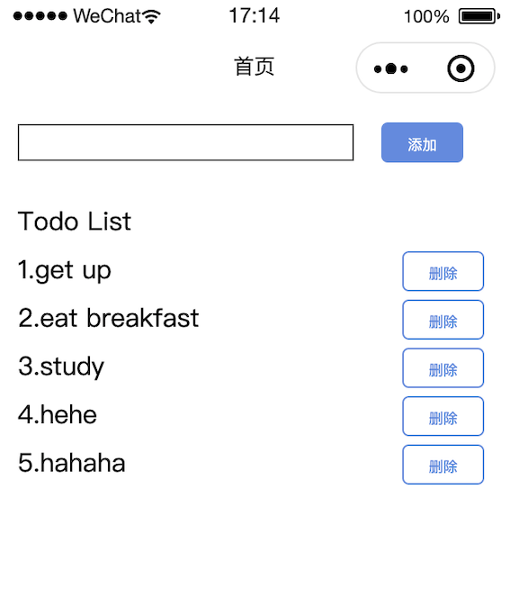

# mini-program-todo
A todo mini program to learn Taro.

## Build
npm script
```
$ npm run dev:weapp
$ npm run build:weapp
```
or:
```
$ taro build --type weapp --watch
$ taro build --type weapp
```

## Screenshots
